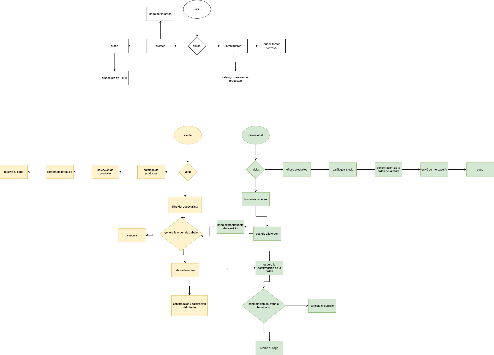
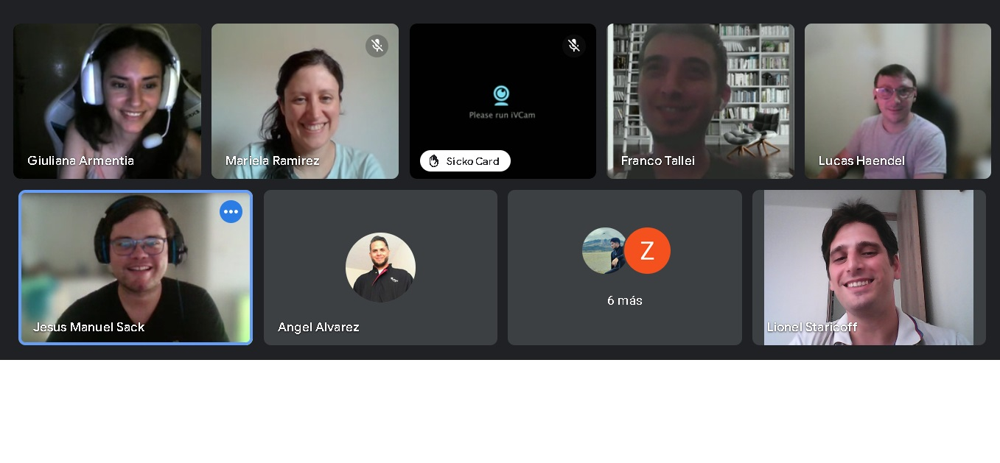
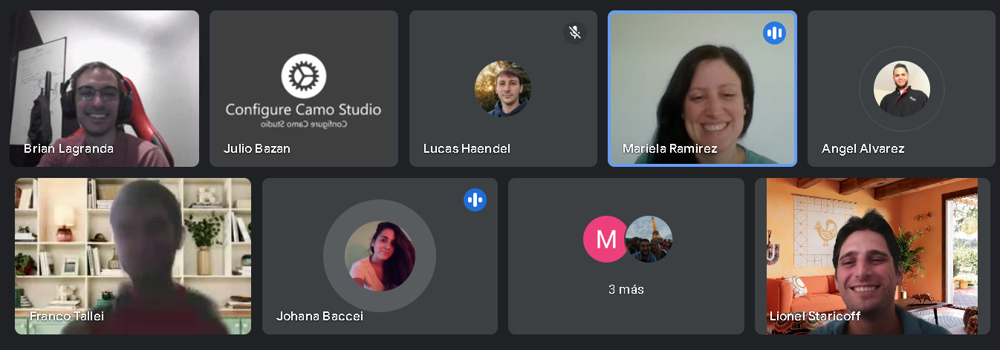

<h1>Proyecto <h1>

## Venta de servicios tercerizados:

Plataforma para contratación de servicios externos, como plomería, además de la venta directa de productos por parte de los usuarios.

<h3>Proyecto:</h3>

#

<h3>Manejo de ramas:</h3>

#

<h3>Equipo:</h3>

#

<h3>Reunion con Johana:</h3>

#

